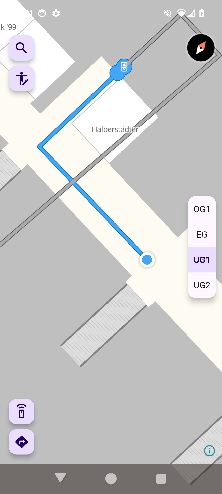

# PIA - Public transport Interchange Assistance

Proof of concept indoor navigation app for mobility impaired people in the context of train stations.

- Based entirely on [OpenStreetMap](https://www.openstreetmap.org) data (routing + indoor visualization)
- Indoor positioning via UWB technology provided by [Pinpoint GmbH](https://pinpoint.de/)
- Indoor- and multi criteria routing by [Per Pedes Routing](https://github.com/motis-project/ppr)
- Indoor vector tiles by [indoor=](https://indoorequal.com/)
- Cross platform (Android and iOS) due to the usage of [Flutter](https://flutter.dev/)

## Screenshots
   